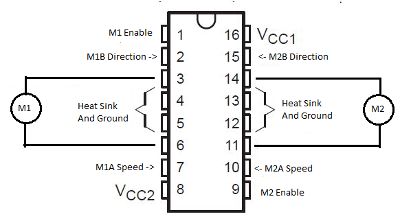
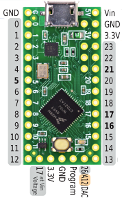
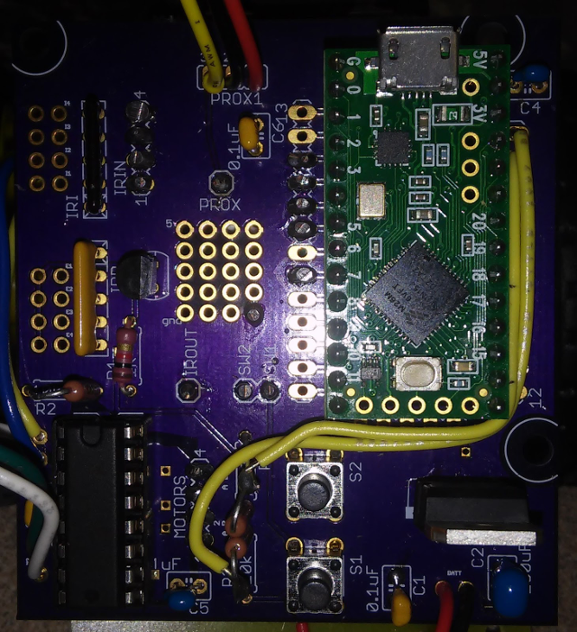

# minisumo
Sample Arduino Code for MiniSumo Robots

This code was written for a project where students built their own mini sumo robots from scratch. They were given an unpopulated circuit board and the components to populate them with. They built the boards themselves, soldering the components, and writing the code to control them. This culminated with a minisumo battle between the participants at the end of the project. Scaling down in this way allowed students the opportunity to create the entire robot themselves, or in groups of 2-3 students.

The code included here provided some basic functions they could use to start writing their own code.

# Installing the Teensy software on your computer
You need to install two things for software development on the minisumo. Arduino and TeensyDuino. Arduino is an IDE for editing and programming software on small boards in the Arduino family and TeensyDuino makes the Arduino software work with the Teensy LC board used in the MLWGS Minisumo kit.

Follow these directions
https://www.pjrc.com/teensy/td_download.html
The arduino software, which you need to write code.
https://www.arduino.cc/en/Main/Software
# Troubleshooting robot circuits
## Testing for Opens and Shorts
Before inserting the Teensy board or the hbridge chip, the board can be checked with a meter to verify the critical connections.
### Testing for opens or grounds

  
Using a meter set to ohms, touch the black probe to the socket for any pin marked GND. On the Teensy, this is the outside corner pin on one side, and the second from the outside corner on the other side and a third in the center of the edge opposite the usb connection. On the hbridge these are the four center pins. All of these points should be connected (common). While holding the black probe to the first point you selected, touch the red probe to each of the other 5 points and for each one, verify the display on the meter changes to 0. If, for any of the pins, the meter does not change to 0, you have an open. Verify the pin has a good solder connection to the board.
## Testing for shorts on the remaining pins
None of the remaining pins should be connected to ground. While holding the black probe to any of the six ground pins, touch the red probe to each of the other non ground pins. For each pin, verify the meter does not change to 0. If it does, that pin is shorted to ground. This may not be right where the pin connects to the board. It could be anywhere in the circuit for that point. You need to identify where it is shorted and fix it before plugging in the Teensy or the hbridge.
Testing for continuity
Now that you have verified there are no opens on ground, and no shorts to ground on the remaining pins, you need to verify the connections you have made between the Teensy and the hbridge are good. 

The hbridge pins that get connected to the Teensy are pins 2, 7, 10, and 15. They are connected by the wires that connect the pads M1 and M2 to the pads for the pins selected on the Teensy for motor direction and speed.
Motor | Hbridge
---|---
M1A | hbridge pin 7
M1B | hbridge pin 2
M2A | hbridge pin 10
M2B | hbridge pin 15

With the meter set to ohms, touch one probe to the socket for the pin selected on the Teensy socket. Touch the second probe to the corresponding pin on the hbridge socket. The meter should display 0. If it doesn’t display 0, the connection between those two points is open. To find where the open is, use the meter to check each point between them until you find where there is a break in the circuit. For example, check between pin 7 of the hbridge socket to the M1A pad on the board. Then check between the M1A pad and the pad the other end of the wire is soldered to. Then check between that pad and the socket for the Teensy pin. Repeat this for all four connections between the Teensy and the hbridge.
### Testing voltages
Switch the meter to DC volts and turn on the power to the robot.
Touch the black probe to any GND pin.
Touch the red probe to the socket for the pin marked 5V on the Arduino socket. The meter should display 5 volts.
Touch the red probe to the socket for the pin marked VCC1 on the hbridge. The meter should display 5 volts.
Touch the red probe to the pin labeled VCC2 on the hbridge. The meter should display 7ish volts.  

### Insert the Teensy
Turn off the power to the robot.
Insert the Teensy board in the socket as shown in the image above.
### Verify voltages between Teensy and hbridge
Now, before inserting the hbridge chip, you can verify the correct voltages reach the hbridge chip. Connect the robot to your laptop with a USB cable. Turn on the robot and program it with the DRIVE_TEST code. Make sure you select the Teensy board as the target device. If it is programmed correctly, the LED on the Teensy should toggle about every seven seconds. If it is blinking every second, that is the default test code that came on the Teensy and it was not programmed correctly. The DRIVE_TEST software drives the robot forward for three seconds, pauses for one second, and drives the robot in reverse for three seconds. It  does all of this at half speed. Without the hbridge plugged in, the wheels won’t turn, but the voltages from the Arduino should still appear at the hbridge socket. 
1. Switch the meter to VDC. 
2. Once again, touch the black probe to any of the 4 center pins for the hbridge socket.
3. Touch the red probe to pin 2. You should see the value on the meter alternate between 0 and 3 volts about every 3 or 4 seconds.
4. Move the red probe to pin 15 and you should see the same thing. 
5. Move the red probe to pin 7 and you should see a voltage of 1.6 volts. 
6. Touch the red probe to pin 10 and you should see a voltage of 1.6 volts.
### Install the hbridge chip
You are now ready to install your hbridge chip. 
Insert it as shown in the image above.
1. Turn off the power to the robot and insert an hbridge chip. 
2. Turn the power back on and the wheels should turn forward for three seconds, pause for one second, and then reverse for three seconds.
If one of the motors is turning in the wrong direction, the easiest way to fix it is to probably switch the wires going to the motor, either where they attach to the board, or at the motor itself, whichever is easiest. You can also fix it in software by swapping the names of drive and turn functions.

If both of the motors are turning in the wrong direction, the easiest way to fix it is by swapping the definitions of kForward and kReverse in the source code.
TODO: Add a  test to verify which motor is left and which is right. If they have them reversed, easiest fix is to change the pin definitions in the source code.
## Sensors
### Circuit test
#### Surface
Verify none of the surface sensors are shorted to ground 
IR out
Surface Pads 1,2,3,4

Verify IR out pin and Teensy socket pin are connected

#### Proximity
### Software test
Load the sensor test program onto the robot.
In the Arduino IDE, under tools-port, select the port to use to talk to the Teensy. If you don’t see a port, make sure you have a USB cable connected to the Teensy.
From the tools menu, select the serial monitor option.
In order for the surface sensors to work the LEDs  must be turned on with the power enable pin. If you are not getting any signal at all from the surface sensors, the first thing to check is that that pin has power.